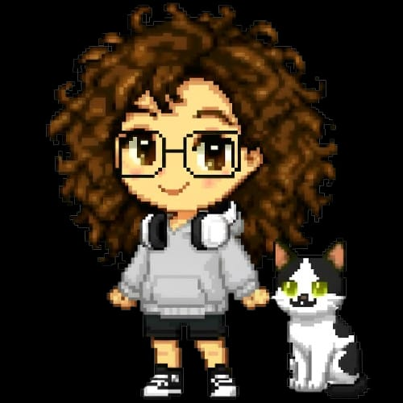

 

  🌸 Pesquisadora &nbsp;·&nbsp; 💻 Desenvolvedora &nbsp;·&nbsp; 📖 Estudante

  <i>"Cultivando inteligência artificial e colhendo soluções doces para o campo."</i>

 

 

---

### 📜 Quest Log (Pesquisa Atual)

> **Missão Principal:** *"Reconhecimento de Animais: Uma Proposta de Sistema Baseado em Visão Computacional e Pontos de Colisão"*
> 
> * **Objetivo:** Aplicar **YOLOv8** para rastrear pequenos ruminantes no semiárido, transformando o manejo rural com tecnologia de precisão.
> * **Status:** Atuando como Aluna Especial no Mestrado e concluindo a graduação na **UFPI**.

 

### 🎒 Inventory (Minhas Ferramentas)

| Categoria | Itens de Crafting |
|--|--|
| 🧠 **AI & Vision** | `YOLOv8`, `Deep Learning`, `Python`, `OpenCV` |
| ⚙️ **Infra & Backend** | `Docker`, `Kubernetes`, `PostgreSQL`, `Supabase` |
| 🎨 **UX & Design** | `Figma`, `SUS/UES Metrics`, `Empathy Maps` |
| 💡 **Education** | `Impressão 3D`, `Lógica de Programação`, `LGPD` |

 

### 🛠️ Skill Level (Tecnologias)

 

### 📊 Farm Stats (GitHub)

  

 

  

